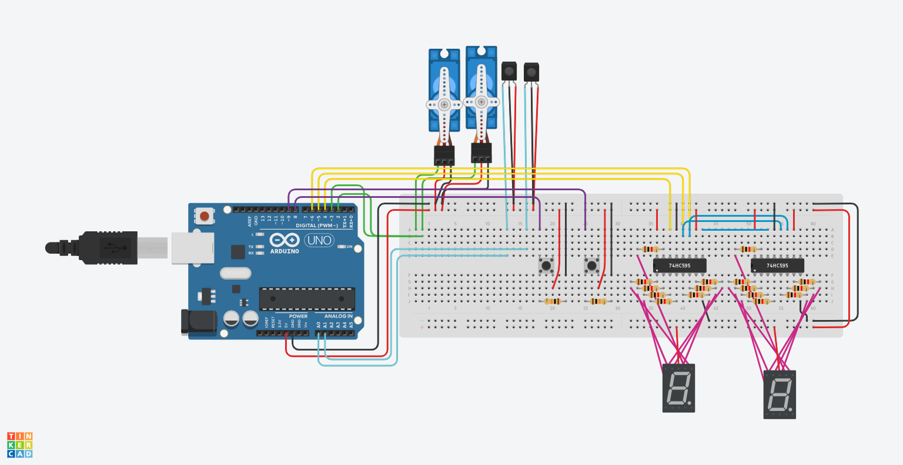

# Flipperkast

Arduino-project voor een flipperkast. De code is opgedeeld in game logic
(`flipperkast.ino`), sensor (`src/sensor/`) en output (`src/output/`).

De Tinkercad-schakeling is `tinkercad.png`.

Zie [project.md](project.md) voor de volledige documentatie en de status van
alle functies.
